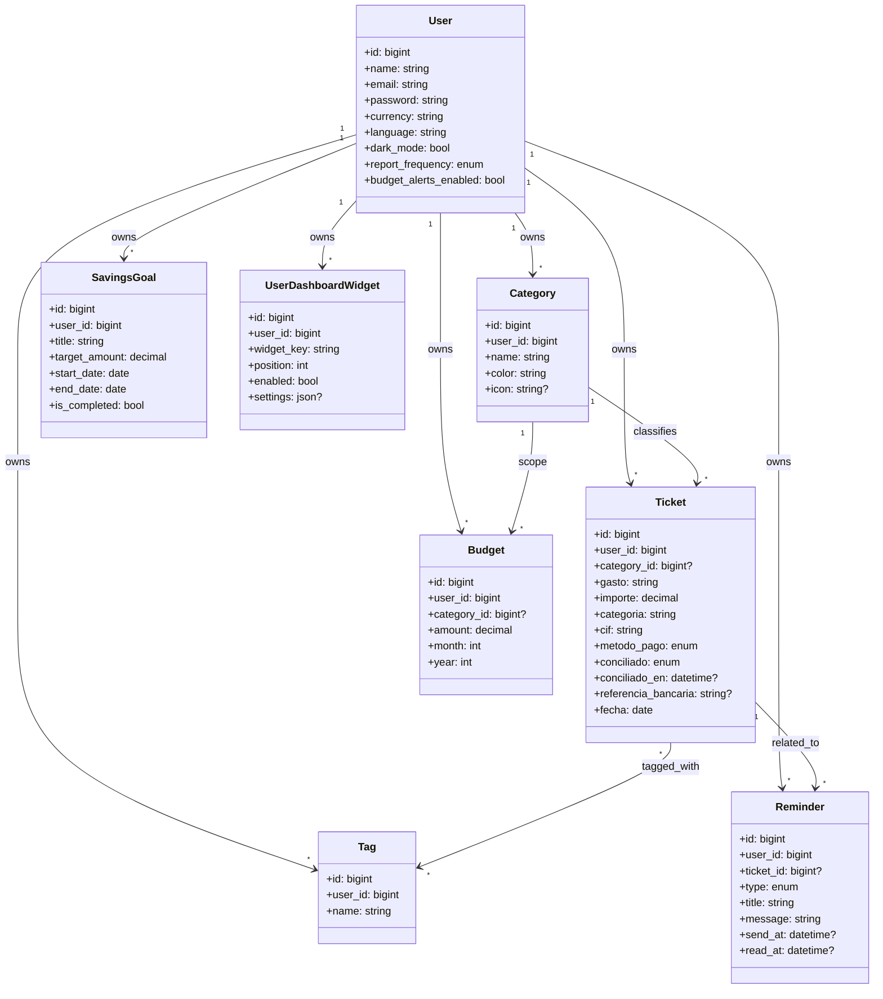
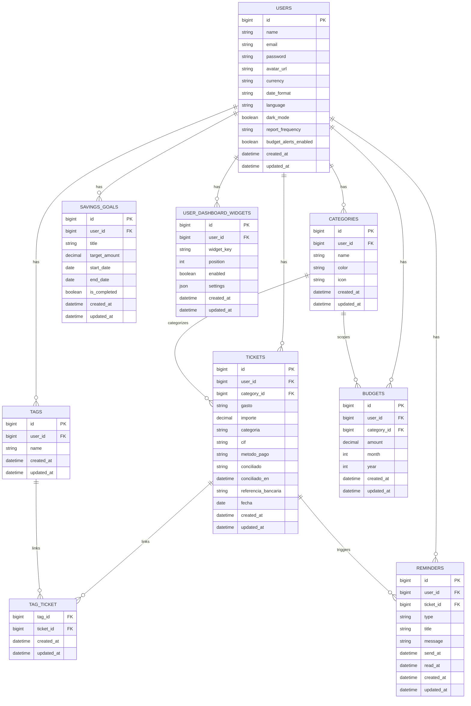

# TicketManager

## ¿De qué va este proyecto?

TicketManager es una plataforma full-stack para **gestión de gastos y tickets**. Permite registrar tickets, categorizarlos, etiquetarlos, conciliarlos con extractos bancarios, controlar presupuestos, crear metas de ahorro, generar reportes y mantener copias de seguridad de la información del usuario.

El proyecto está dividido en:

- **Backend API** (Laravel) con autenticación y lógica de negocio.
- **Frontend SPA** (Vue 3 + TypeScript) para la operación diaria de usuarios.

---

## Tecnologías utilizadas

### Backend

- PHP 8.x
- Laravel 12
- Laravel Sanctum (autenticación)
- Eloquent ORM
- MySQL 8
- MongoDB (contenedor disponible en entorno Docker)
- Docker + Docker Compose

### Frontend

- Vue 3 (Composition API)
- TypeScript
- Vite
- Vue Router
- Axios
- Tailwind CSS

---

## ¿Qué se puede hacer?

### Autenticación y perfil

- Registro e inicio de sesión
- Perfil de usuario con preferencias (moneda, idioma, formato de fecha, modo oscuro, etc.)
- Cambio de contraseña

### Tickets y organización

- CRUD de tickets
- Filtros y búsqueda avanzada (texto, fechas, categoría, estado, etiqueta, orden)
- Relación de tickets con categorías y etiquetas
- Conciliación individual y masiva

### Finanzas y seguimiento

- Gestión de presupuestos por mes/año (globales o por categoría)
- Alertas de consumo de presupuesto (`ok`, `near_limit`, `exceeded`)
- Metas de ahorro con cálculo de progreso

### Reportes

- Comparativas de gasto (mes actual vs mes anterior / año anterior)
- Evolución diaria, por categoría y por día de semana
- Calendario de gastos
- Resumen semanal o mensual
- Exportación de reportes en CSV/XLS

### Productividad y mantenimiento

- Recordatorios (in-app/email) con marcado de lectura
- Widgets personalizables del dashboard
- Backup y restauración de datos de usuario
- Importación de CSV bancario para conciliación

---

## Buenas prácticas aplicadas

- **Arquitectura por capas en backend**: rutas, controladores, modelos y validación por request.
- **Validación robusta** de datos de entrada en endpoints críticos.
- **Control de acceso por usuario** en recursos (ownership checks).
- **Modelado relacional claro** con claves foráneas y tabla pivote (`tag_ticket`).
- **Migrations versionadas** para evolución del esquema.
- **Contenerización** del entorno (app + mysql + mongo) para reproducibilidad.
- **Frontend tipado con TypeScript** para reducir errores de integración API/UI.
- **Composables reutilizables** (`useAuth`, `useTickets`) para lógica compartida.
- **Navegación protegida** por estado de autenticación.
- **Formato de respuesta paginada** en listados grandes para escalabilidad.
- **Operaciones sensibles con confirmación** (eliminaciones, restauración, conciliación masiva).

---

## Diagrama de clases (dominio principal)



---

## Diagrama de base de datos (ERD)



---

## Notas de ejecución rápida

### Backend

```bash
docker compose up -d
docker compose exec app php artisan migrate --force
```

### Frontend

```bash
npm install
npm run dev
```

